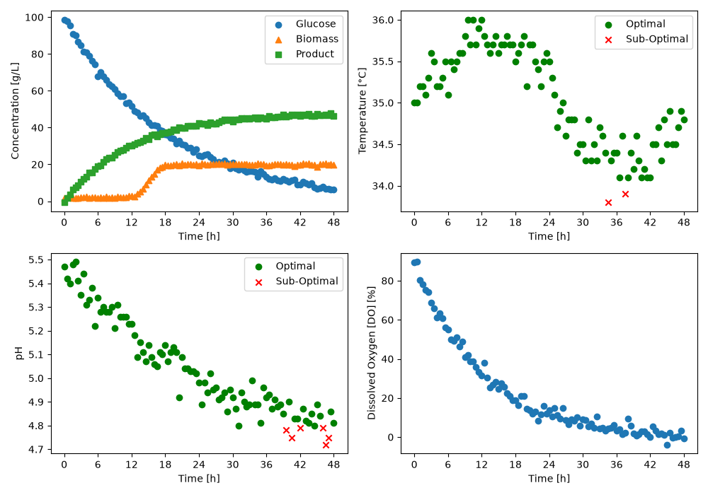

# Fermentation BioProcess Monitoring

A tool for monitoring fermentation processes and automatically generating batch dashboards and summary tables.

## Overview

The objective is to analyze fermentation batch data and monitor important process variables such as pH, temperature, dissolved oxygen, glucose concentration, biomass concentration, and product concentration.
The program identifies whether pH and temperature measurements are within specified operating ranges and generates visual dashboards and summary tables for process analysis.

## Features

The `BioprocessMonitor` class automates:

The objective of this project is to create a Python class called BioprocessMonitor that automates:
1-Batch extraction from a fermentation dataset.
2-Identification of measurements within acceptable operating ranges.
3-Generation of dashboard figures.
4-Creation of batch-level summary tables.

## Technologies Used
Python version 3.14.7
pandas version 3.0.5
Matplotlib version 3.11.0

## Code Design
When `main.py` is runned, the fermentation dataset is loaded and two BioprocessMonitor objects are created using different pH and temperature operating limits.
The program will determine the number of batches in the dataset for each config and processes each batch individually. 
A dashboard is generated for every batch and saved in the figures directory.
After all batches have been processed, a summary table is generated for each monitoring configuration and saved in the tables directory.

## Dashboard

Dashboard of Batch 1 in mode A showing : 
1-Glucose,biomass and product concentrations vs time.
2-Temperature vs time
3-pH vs time
4-Dissolved O vs time
The outside rannge points are marked with a red X

## Summary Table

|batch_id|ph optimal+percent|temperature_optimal percent|C_product [g/L]|
|------|--------|------------------|---------------------------|---------------|
|1       |93.81   |97.94             |46.5                       |               |
|2       |96.69   |97.52             |50.8                       |               |
|3       |95.89   |93.15             |44.6                       |               |
|4       |100.0   |96.47             |48.6                       |               |
|5       |48.62   |99.08             |24.7                       |               |

Summary table for mode A
This table reports the percentage of pH and temperature that fall within their specified operating ranges for each batch. 
It also reports the final product concentration for each fermentation batch.
